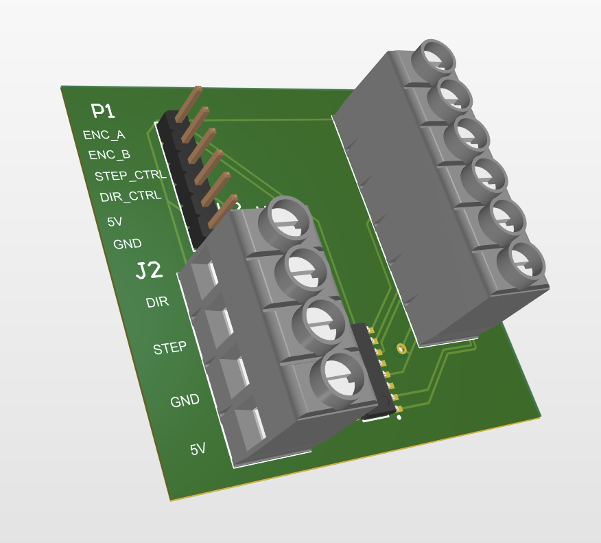

# SCD2 Dual-Core Optical Motion Testbed

A complete embedded motion-instrument case study spanning two directly visible engineering sides:

1. **Dual-core firmware, host software, and measured results**
2. **Mechanical platform, custom interface PCB, and electrical integration**

## Start with the two reports

- **[Dual-Core Firmware, Host Software & Results FRD](SCD2_DualCore_Firmware_Host_FRD_v2.5.pdf)**
- **[Mechanical Platform & Interface PCB FRD](SCD2_Platform_Electrical_FRD_v2.5.pdf)**

## Featured interface PCB

- **[Featured PCB schematic](SCD2_Encoder_STEP_Interface_Schematic.pdf)**
- Differential A/B encoder reception through an AM26LS32
- Controller-facing ENC_A / ENC_B / STEP_CTRL / DIR_CTRL signals
- R725 STEP/DIR motor-driver interface
- Dedicated solid-copper ground plane

## Dual-core firmware headline

- STM32H747: 400 MHz Cortex-M7 + 200 MHz Cortex-M4
- OpenAMP/RPMsg control and status messaging
- 256 KiB AXI-SRAM producer/consumer ring
- 64-byte records at 100 Hz (6.4 kB/s internal data path)
- sequence-gap, overflow, heartbeat, and fault monitoring
- live GUI, timestamped logging, automated workflows, and measured results

## Repository sections

- [`01-dual-core-firmware/`](01-dual-core-firmware/) — architecture, source excerpts, GUI, video, and results
- [`02-platform-electrical/`](02-platform-electrical/) — exploded assembly, PCB, schematic, physical media, and platform report

No third-party affiliation or endorsement is claimed.
