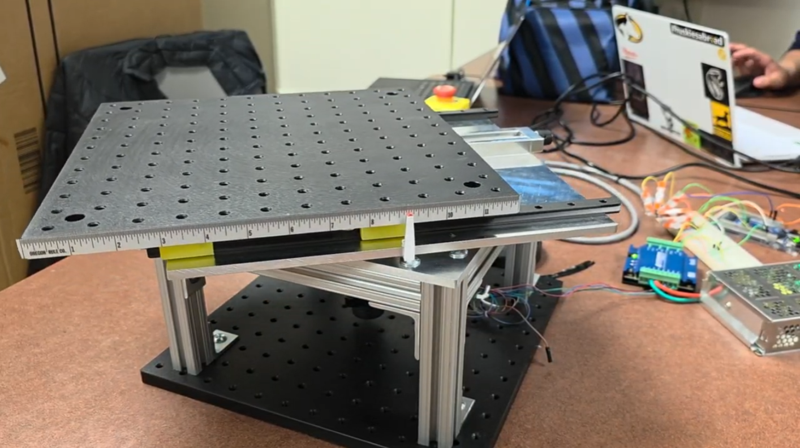
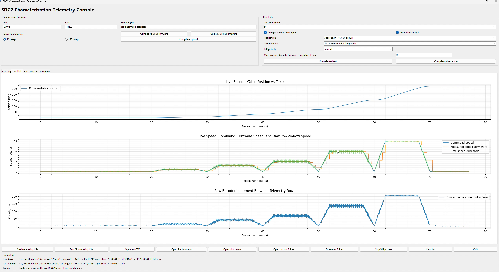

# SCD2 Dual-Axis Optical Motion Testbed

A customer-facing case study of a dual-axis optical motion platform developed through two coordinated engineering layers:

1. **Hardware & Electrical Integration** — mechanical architecture, load-bearing structure, encoder and motor-driver interfaces, firm-designed interface PCB, and physical verification evidence.
2. **Firmware, Software & Characterization** — dual-core target integration, timestamped telemetry, automated test workflows, host-side GUI, structured data capture, and motion-characterization results.

The repository presents system capabilities and measured evidence without releasing proprietary implementation source, editable manufacturing data, internal troubleshooting records, or development archives.

---

## 1. Hardware & Electrical Integration

The physical platform combines a rotational test stage, manual lateral-offset mechanism, encoder feedback, motor-driver control, structural framing, and an independently designed electrical interface board.

### Featured deliverables

- [Hardware & Electrical FRD — PDF](01-hardware-electrical/docs/SCD2_Hardware_Electrical_FRD.pdf)
- [Hardware & Electrical FRD — DOCX](01-hardware-electrical/docs/SCD2_Hardware_Electrical_FRD.docx)
- [Encoder/STEP Interface Schematic](01-hardware-electrical/schematic/Encoder_STEP_Interface_Schematic.pdf)
- [Physical System Demonstration](01-hardware-electrical/media/physical-system-demonstration.mp4)
- [Mechanical Assembly Animation](01-hardware-electrical/media/mechanical-assembly-animation.mp4)

### Evidence included

- assembled and loaded system photographs
- mechanical exploded view and alignment details
- representative rotation-rate response
- featured electrical schematic
- routed-layer evidence
- solid-copper ground-plane evidence
- populated 3D PCB renders

---

## 2. Firmware, Software & Characterization

The post-handoff extension converted the embedded platform into an operator-facing characterization system. The target owns motion timing and telemetry generation; the host provides test orchestration, live visualization, structured logging, and analysis workflows.

### Featured deliverables

- [Firmware, Software & Characterization FRD — PDF](02-firmware-software/docs/SCD2_Firmware_Software_FRD.pdf)
- [Firmware, Software & Characterization FRD — DOCX](02-firmware-software/docs/SCD2_Firmware_Software_FRD.docx)
- [Host–Target Interface Demonstration](02-firmware-software/media/host-target-interface-demo.mp4)

### Demonstrated capabilities

- dual-core embedded target integration
- deterministic scripted motion tests
- timestamped command and encoder telemetry
- operator-facing GUI and live plots
- CSV logging and metadata capture
- long-duration speed tracking
- step-response characterization
- static-hold and Allan-style stability analysis
- closed-loop frequency-response estimation

### Representative results

- [Test-sequence overview](02-firmware-software/results/representative-test-sequences.png)
- [Constant-speed tracking summary](02-firmware-software/results/constant-speed-tracking-summary.png)
- [Step-response summary](02-firmware-software/results/step-response-summary.png)
- [Closed-loop frequency-response summary](02-firmware-software/results/closed-loop-frequency-response.png)

---

## Engineering scope demonstrated

This case study demonstrates full-stack experimental-system work across mechanical integration, PCB design, embedded control, instrumentation, telemetry, desktop software, test automation, and engineering analysis.

The original physical platform was produced by a four-person engineering team led by the founder of Herder Elektronische Systemen. The later dual-core firmware integration, timestamped acquisition, GUI, automated characterization workflows, and customer-facing reporting were completed after the original project handoff.

## Public release boundary

Included here:

- controlled technical reports
- selected photographs and renders
- demonstration videos
- sanitized plots and system-level evidence
- one-page public schematic

Not included:

- firmware or host-application source code
- exact serial protocol and internal state-machine implementation
- editable PCB, CAD, or manufacturing sources
- raw customer or laboratory data
- duplicate development packages and internal debugging records

See [NOTICE.md](NOTICE.md) for attribution and release boundaries.
